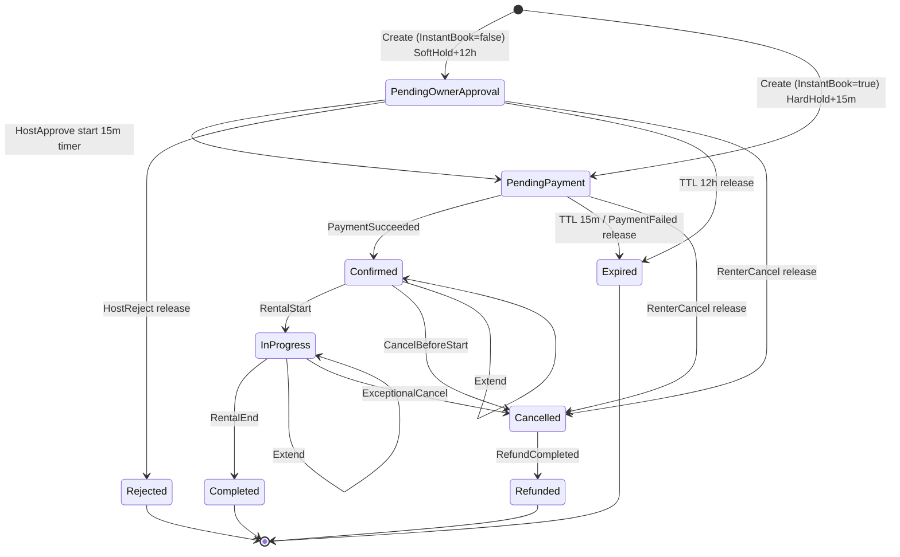

# EHUB-502 — Booking State Machine

**Status:** APPROVED WITH MINOR CHANGES (Architect 2026-07-19).

## Statuses

| Code | Hold | Blocking availability? | Terminal? |
|------|------|------------------------|-----------|
| `Draft` | — | No | No (optional; may skip in API) |
| `PendingOwnerApproval` | Soft Hold | **Yes** | No |
| `PendingPayment` | Hard Hold | **Yes** | No |
| `Confirmed` | Committed | **Yes** | No |
| `Rejected` | Released | No | **Yes** |
| `Cancelled` | Released | No | **Yes** |
| `Expired` | Released | No | **Yes** |
| `InProgress` | Committed | **Yes** | No |
| `Completed` | Released | No | **Yes** |
| `Refunded` | — | No | **Yes** |

## Transition diagram

**Critical:** Payment TTL does **not** run during Soft Hold. Timer starts only on `HostApprove` (or Instant Book create).

## Allowed transitions matrix

| From \ To | POA | PP | Confirmed | Rejected | Cancelled | Expired | InProgress | Completed | Refunded |
|-----------|-----|----|----|----|----|----|----|----|----|
| PendingOwnerApproval | — | ✓ | | ✓ | ✓ | ✓ | | | |
| PendingPayment | | — | ✓ | | ✓ | ✓ | | | |
| Confirmed | | | ✓* | | ✓ | | ✓ | | |
| InProgress | | | ✓* | | ✓† | | — | ✓ | |
| Cancelled | | | | | — | | | | ✓ |
| Others terminal | | | | | | | | | |

\* Extend keeps status, updates period (+ buffer re-check).  
† Exceptional only.

## Illegal examples

- Payment timer starting at create when InstantBook=false  
- `Expired` → `Confirmed` without new booking  
- Host `Approve` from `Confirmed`

## Sign-off

- [x] Status list locked  
- [x] TTL 12h / 15m locked  
- [x] Payment timer after Approve locked
