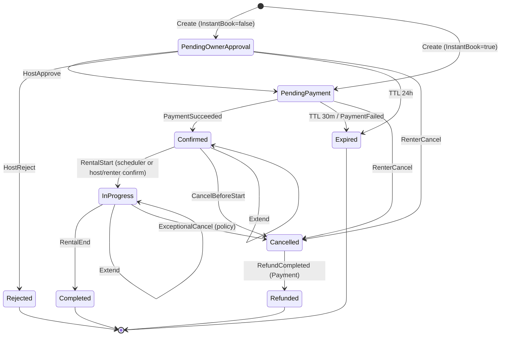

# EHUB-502 — Booking State Machine

**Status:** Draft for sign-off.

## Statuses

| Code | Blocking availability? | Terminal? |
|------|------------------------|-----------|
| `Draft` | No | No (optional; may skip in API) |
| `PendingOwnerApproval` | **Yes** | No |
| `PendingPayment` | **Yes** | No |
| `Confirmed` | **Yes** | No |
| `Rejected` | No | **Yes** |
| `Cancelled` | No | **Yes** |
| `Expired` | No | **Yes** |
| `InProgress` | **Yes** | No |
| `Completed` | No | **Yes** |
| `Refunded` | No | **Yes** (or sub-state of Cancelled — v1 keep separate) |

Align Catalog `BookingStatus` seed codes with these values (replace current PENDING/CONFIRMED/… seed when implementing).

## Transition diagram

## Allowed transitions matrix

| From \ To | POA | PP | Confirmed | Rejected | Cancelled | Expired | InProgress | Completed | Refunded |
|-----------|-----|----|----|----|----|----|----|----|----|
| PendingOwnerApproval | — | ✓ | | ✓ | ✓ | ✓ | | | |
| PendingPayment | | — | ✓ | | ✓ | ✓ | | | |
| Confirmed | | | ✓* | | ✓ | | ✓ | | |
| InProgress | | | ✓* | | ✓† | | — | ✓ | |
| Cancelled | | | | | — | | | | ✓ |
| Others terminal | | | | | | | | | |

\* Extend keeps status, updates period.  
† Exceptional only — product must confirm.

## Illegal examples

- `Completed` → `Confirmed`  
- `Rejected` → `PendingPayment`  
- `Expired` → `Confirmed` without new booking  
- Host `Approve` from `Confirmed`

## Sign-off

- [ ] Status list locked  
- [ ] TTL transitions locked  
- [ ] Extend stays in place confirmed
