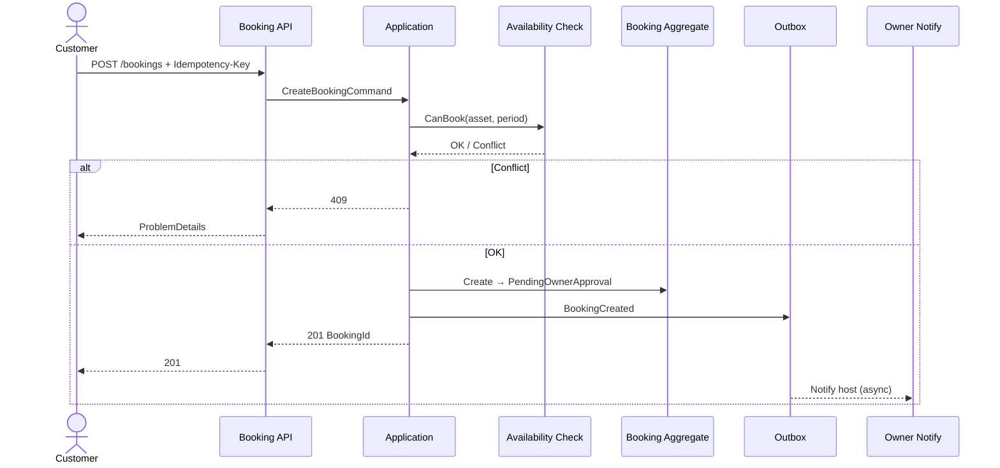
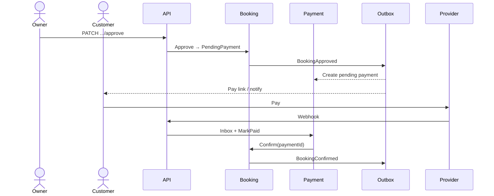
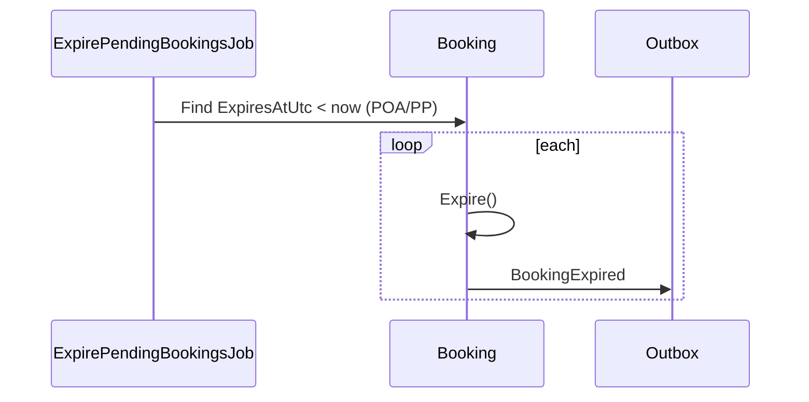

# EHUB-507 — Sequence Diagrams

**Status:** Draft for sign-off.

## 1. Create booking (host approval)



## 2. Approve → pay → confirm



## 3. Expire pending



## 4. End-to-end modules

```text
Customer → Booking API → Availability → Booking Aggregate
                ↓
            Outbox → Payment → Provider
                ↓
            Outbox → Notification → Owner/Customer
```

## Sign-off

- [ ] Create sequence approved  
- [ ] Pay confirm sequence approved
