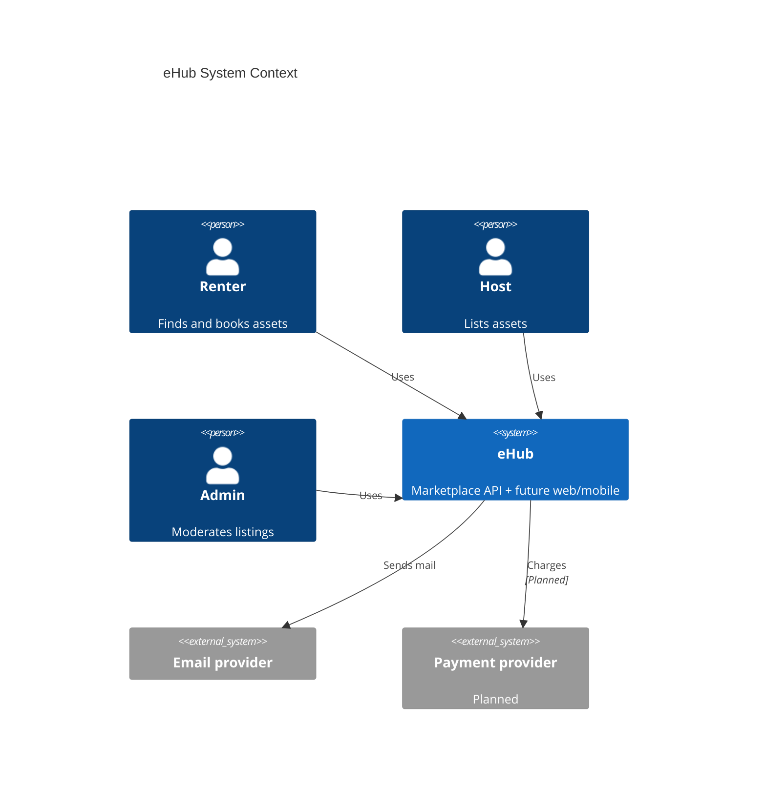
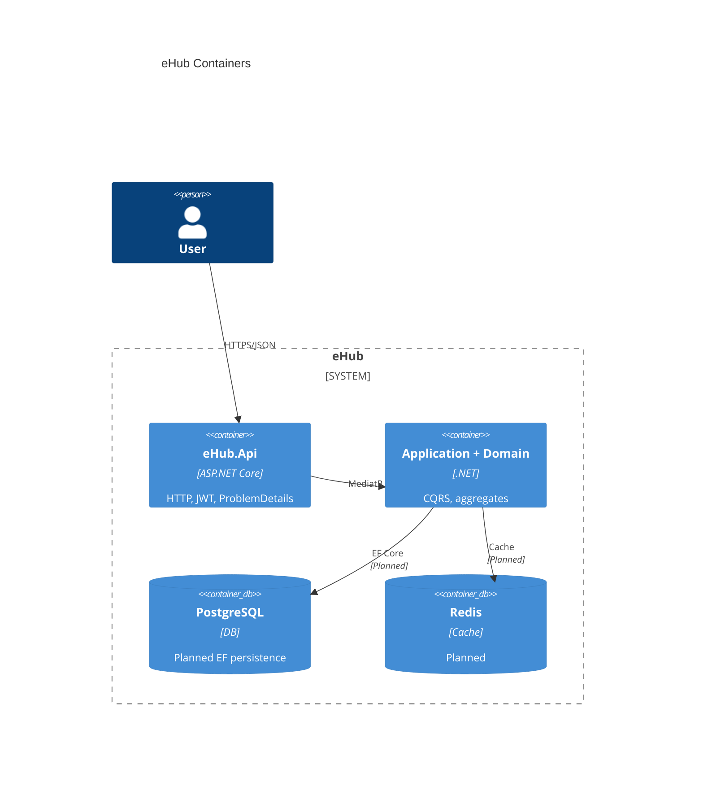

# C4 model (draft)

## Level 1 — Context

## Level 2 — Containers

## Level 3 — Components (API / Application)

- **Identity** — auth, sessions, login history  
- **Catalog** — dictionaries  
- **Assets** — universal listing aggregate  
- **Booking / Payment / Notification** — planned separate modules  

See [architecture.md](architecture.md) for dependency rules.
