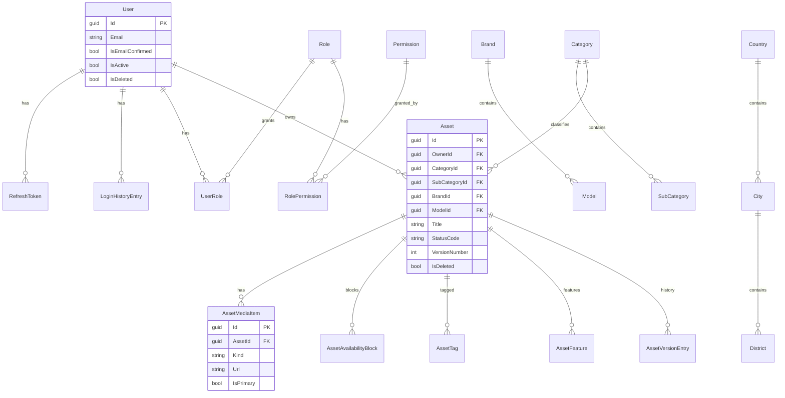
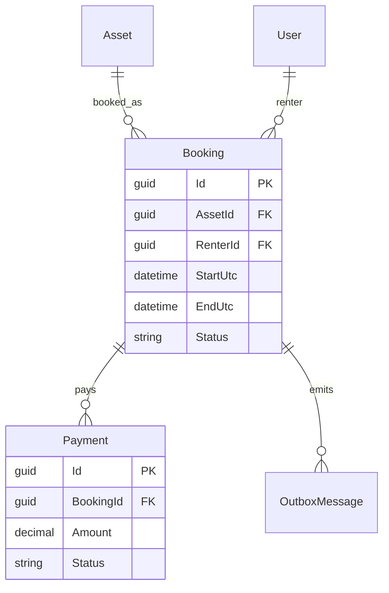

# ERD (current + planned)

Logical model. Persistence is still in-memory; this is the target relational shape.

## Current

Catalog dictionaries (Currency, FuelType, AssetStatus, …) are flat lookup tables keyed by `Code`.

## Planned (Booking sprint)

**Rules:** Payment is its own aggregate. Booking owns availability conflict checks; use transactions + optimistic concurrency; side effects via outbox/domain events.
