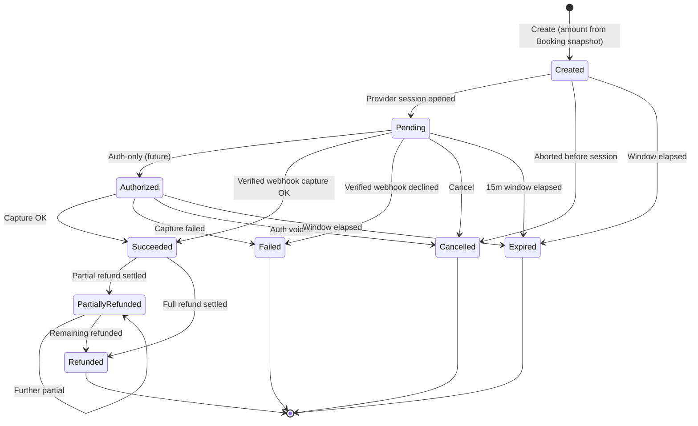

# EHUB-602 — Payment State Machine

**Status:** READY FOR ARCHITECT REVIEW

## Statuses (locked candidate)

| Code | Meaning | Money captured? | Terminal? |
|------|---------|-----------------|-----------|
| `Created` | Row created; provider session not open | No | No |
| `Pending` | Provider session open; awaiting result | No | No |
| `Authorized` | Auth-only hold (future); not captured | Held | No |
| `Succeeded` | Captured — **only** state that can confirm Booking (L3) | Yes | No* |
| `Failed` | Declined / capture failed | No | **Yes** |
| `Cancelled` | Cancelled before success | No | **Yes** |
| `Expired` | 15m window elapsed without success | No | **Yes** |
| `PartiallyRefunded` | Some but not all refunded | Yes (net) | No* |
| `Refunded` | Fully refunded | No (net 0) | **Yes** |

\* `Succeeded` / `PartiallyRefunded` allow further refunds (L5).

## Transition diagram

## Allowed transitions

| From \ To | Pending | Authorized | Succeeded | Failed | Cancelled | Expired | PartiallyRefunded | Refunded |
|-----------|:-------:|:----------:|:---------:|:------:|:---------:|:-------:|:-----------------:|:--------:|
| Created | ✓ | | | | ✓ | ✓ | | |
| Pending | | ✓ | ✓ | ✓ | ✓ | ✓ | | |
| Authorized | | — | ✓ | ✓ | ✓ | ✓ | | |
| Succeeded | | | — | | | | ✓ | ✓ |
| PartiallyRefunded | | | | | | | ✓ | ✓ |
| Failed / Cancelled / Expired / Refunded | | | | | | | | terminal |

## Late success vs terminal Payment (L4)

| Payment status when money arrives | Booking status | Action |
|-----------------------------------|----------------|--------|
| `Pending` / `Authorized` | `PendingPayment` + hold active | → `Succeeded` → Outbox confirm (L3) |
| `Pending` / `Authorized` | `Expired` / terminal | → `Succeeded` (money recorded) → **no Booking confirm** → auto-refund → `Refunded` |
| Already `Expired` / `Failed` / `Cancelled` | any | **Do not** flip to `Succeeded`. Audit attempt + reconcile / refund at provider if needed |

Illegal: `Expired` → `Succeeded` as a normal status transition.

## Idempotent no-ops (L2)

Re-applying the **same** target status from the **same** provider event = **no-op success** (`200`), not an error.

## Booking mapping

| Payment event | Booking effect |
|---------------|----------------|
| → `Succeeded` + hold active | `Confirm(paymentId)` via Outbox |
| → `Succeeded` + Booking terminal | **No confirm** → auto-refund |
| → `Failed` | Booking TTL continues; notify; optional retry (L10) |
| → `Expired` | Align with Booking expire / hold release |
| → `Refunded` / partial | `BookingRefunded` / notify via Outbox |

## Sign-off

- [ ] Nine statuses locked
- [ ] Succeeded-only-confirms + late-callback table approved
- [ ] Failed does not freeze Booking forever approved
