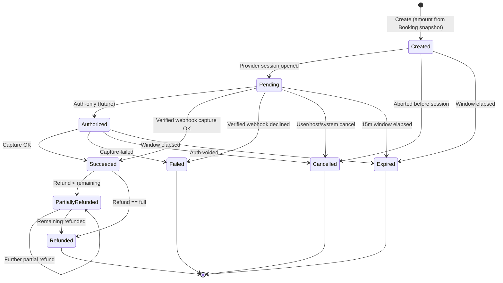

# EHUB-602 — Payment State Machine

**Status:** DRAFT — awaiting Architect review.

## Statuses

| Code | Meaning | Money captured? | Terminal? |
|------|---------|-----------------|-----------|
| `Created` | Payment row created, provider session not yet opened | No | No |
| `Pending` | Provider session open, awaiting result | No | No |
| `Authorized` | Funds authorized (auth-only), not captured — reserved for future | Held | No |
| `Succeeded` | Captured / paid — **the only state that confirms a Booking** (L3) | Yes | No* |
| `Failed` | Provider declined / capture failed | No | **Yes** |
| `Cancelled` | Cancelled before success (user/host/system) | No | **Yes** |
| `Expired` | Payment window (15m) elapsed with no success | No | **Yes** |
| `PartiallyRefunded` | Succeeded then partially refunded | Yes (net) | No* |
| `Refunded` | Fully refunded | No (net 0) | **Yes** |

\* `Succeeded` / `PartiallyRefunded` are not terminal because refunds may still occur (L5).

## Transition diagram

**Critical:** Only `Pending`/`Authorized` → `Succeeded` confirms a Booking, and only if the Booking is still in `PendingPayment` with an **active** hold. A `Succeeded` arriving for an `Expired`/terminal Booking does **not** confirm it (L4) — it triggers reconciliation/auto-refund.

## Allowed transitions matrix

| From \ To | Pending | Authorized | Succeeded | Failed | Cancelled | Expired | PartRefunded | Refunded |
|-----------|:--:|:--:|:--:|:--:|:--:|:--:|:--:|:--:|
| Created | ✓ | | | | ✓ | ✓ | | |
| Pending | | ✓ | ✓ | ✓ | ✓ | ✓ | | |
| Authorized | | — | ✓ | ✓ | ✓ | ✓ | | |
| Succeeded | | | — | | | | ✓ | ✓ |
| PartiallyRefunded | | | | | | | ✓ | ✓ |
| Failed / Cancelled / Expired / Refunded | | | | | | | | (terminal) |

## Idempotent no-op transitions

Because webhooks may be replayed (L2), re-applying the **same** target status from the same provider event is a **no-op success** (ack `200`, no second effect), not an error. Only a *different* target from a terminal state is illegal.

## Illegal examples

- `Expired` → `Succeeded` (late callback confirming a dead payment). Late success is recorded as an attempt + reconciliation, not a status flip on a terminal Payment.
- `Failed` → `Succeeded` on a **different** event.
- Refund from `Pending` (nothing captured yet).
- `Succeeded` with captured amount ≠ `Amount` (BR-PAY-001 mismatch → treated as failure/reconcile).

## Mapping to Booking

| Payment transition | Booking effect (via Outbox) |
|--------------------|-----------------------------|
| → `Succeeded` (hold active) | `BookingConfirmed` |
| → `Failed` / `Expired` | Booking expire path (per BR-BKG-007/010) |
| → `Refunded` | `BookingRefunded` |
| → `Succeeded` (Booking terminal) | **No confirm** — reconcile/auto-refund (L4) |

## Sign-off

- [ ] Status list locked
- [ ] `Succeeded`-only-confirms rule locked
- [ ] Idempotent no-op transition semantics approved
