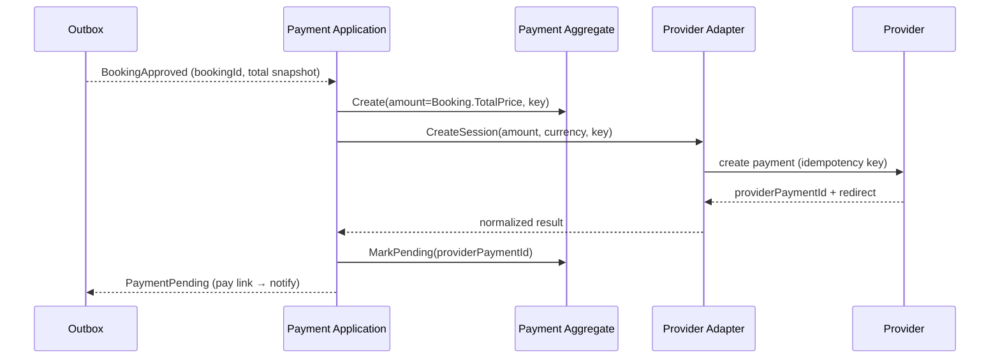
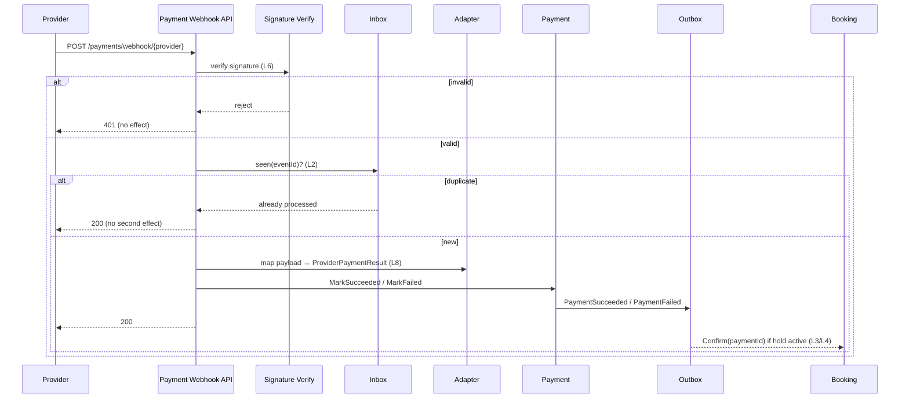

# EHUB-603 — Payment Lifecycle

**Status:** READY FOR ARCHITECT REVIEW

## Happy path (approve → pay → confirm)

```text
Booking approved (PendingPayment, 15m Hard Hold timer starts)
        ↓  BookingApproved (Outbox)
Payment created
  Amount = Booking.TotalPrice snapshot   ← client price ignored (L1)
  Status = Created → Pending
  IdempotencyKey assigned
        ↓
Provider session opened (ProviderPaymentId captured via adapter)
        ↓
Customer pays at provider
        ↓
Provider webhook  →  signature verified (L6)  →  inbox dedupe (L2)
        ↓
Adapter maps payload → ProviderPaymentResult (L8)
        ↓
Payment.MarkSucceeded(paidAtUtc)   (amount matches Amount)
        ↓  PaymentSucceeded (Outbox, L9)
Booking still PendingPayment + hold active?
   ├─ yes → Booking.Confirm(paymentId) → Confirmed (L3)
   └─ no  → do NOT confirm → reconcile / auto-refund (L4)
```

## Sequence — create payment on approval



## Sequence — webhook → confirm



## Failed payment path (L10)

```text
Verified webhook → Failed
        ↓
Payment.MarkFailed(normalized reason)
        ↓
Booking remains PendingPayment (TTL still ticking)
        ↓
Notify renter · allow retry (new Payment) while hold active
        ↓
If still unpaid at 15m → Booking + Payment Expired (hold released)
```

Booking is **never** stuck forever waiting on a failed charge.

## Timeout / expiry path

```text
15m elapses with no Succeeded
        ↓
Booking expire job → Booking Expired (hold released)
Payment → Expired (payment expire / reconcile)
        ↓
Provider session abandoned / cancelled at provider
```

## Late callback path (L4)

```text
Booking already Expired (or other terminal)
Payment still Pending/Authorized OR provider still accepts pay
        ↓
Customer pays late → verified + deduped webhook
        ↓
If Payment still Pending/Authorized:
  MarkSucceeded (money recorded) → do NOT Confirm Booking
  → auto full refund → Refunded
If Payment already Expired/Failed/Cancelled:
  do NOT flip to Succeeded
  → audit attempt + reconcile/refund at provider if money moved
```

## Refund path (separate operation, L5)

```text
Booking cancellation decides refund amount (BR-BKG-014)
        ↓  RefundInstruction (Outbox)
Payment.AddRefund(amount, reason)
        ↓
Adapter → Provider refund (idempotency key)
        ↓
Refund Succeeded → RefundedAmount += amount
        ↓
Status → PartiallyRefunded | Refunded
        ↓  PaymentRefunded (Outbox) → BookingRefunded
```

## Responsibilities by step

| Step | Owner component |
|------|-----------------|
| Amount from snapshot | Payment aggregate (copies Booking `TotalPrice`) |
| Provider session / charge | Provider adapter (ACL) |
| Signature verify | Webhook endpoint + provider adapter |
| Dedupe | Inbox / idempotency store |
| Confirm decision | Booking aggregate (reacts to event) |
| Refund | Payment aggregate + adapter |
| Notify | Outbox → Notification |

## Sign-off

- [ ] Happy path + confirm-after-succeeded approved
- [ ] Failed → TTL continues + retry approved (L10)
- [ ] Late-callback → no confirm + auto-refund approved
- [ ] Refund lifecycle approved
