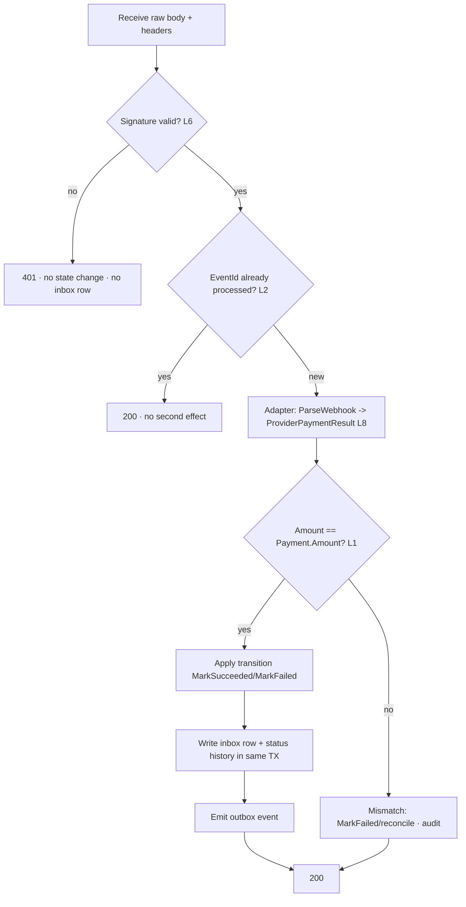

# EHUB-605 — Webhook Strategy

**Status:** DRAFT — awaiting Architect review.

## Principle

> A webhook is the **only source of payment effect** (BR-PAY-005). It must be **verified** (L6) and **processed exactly once** (L2) before it touches any domain state.

## Endpoint

```text
POST /api/v1/payments/webhook/{provider}
Auth: none (public) — trust comes from SIGNATURE, not JWT
Body: raw provider payload (read raw bytes for signature)
```

## Mandatory processing order



**Order is non-negotiable:** verify → dedupe → parse → validate amount → apply → ack. Never parse-into-domain or apply an effect before signature verification.

## Signature verification (L6)

| Rule | Detail |
|------|--------|
| Raw body | Verify against the **raw** received bytes, before JSON deserialization. |
| Secret | Per-provider signing secret from config; rotated without code change. |
| Timestamp | Reject stale webhooks outside provider tolerance window (replay hardening). |
| Failure | `401`, no inbox row committed as processed, no domain change. |
| Location | Implemented in provider adapter `VerifySignature` (ACL-4). |

## Deduplication (L2)

- Dedupe key = **provider event id** (fallback: hash of `{provider, providerPaymentId, outcome, amount}` if provider has no stable id).
- Stored in a `PaymentInbox` (processed-messages) table with a **unique** constraint on `(Provider, EventId)`.
- Insert-then-process in one transaction: a duplicate insert fails the unique constraint → treat as already processed → `200`, no effect.
- Same webhook replayed → same outcome, no second confirm/refund (idempotent).

## Response codes

| Code | When |
|------|------|
| `200` | Verified + processed, **or** verified duplicate (no-op) |
| `401` | Signature invalid |
| `400` | Unparseable payload after valid signature (rare) |
| `404` | Unknown provider route / unknown Payment reference |
| `409` | Recorded as attempt but not applicable (e.g. late success on terminal Booking) → still `200` to stop provider retries; internal reconcile flagged |

> Providers retry non-`2xx`. We return `200` for anything we have durably **recorded** (including deduped + late-callback-recorded) so the provider stops retrying, while internal reconciliation handles the anomaly.

## Return URL vs webhook

| Channel | Trust | Effect |
|---------|-------|--------|
| Browser return URL | UX only | **None** — shows "processing" until webhook lands |
| Webhook | Signature-verified | **Authoritative** state change |
| Reconciliation poll | Server-to-provider | Fallback if webhook missed; same rules |

## Ordering & races

- Webhooks may arrive **out of order** or **before** the create-response is persisted. Handler is defensive: unknown `providerPaymentId` → short retry / park in inbox, not a hard failure.
- Late `Succeeded` after Booking `Expired` → recorded, **no confirm** (L4), reconcile.

## Sign-off

- [ ] Verify → dedupe → parse → apply order locked
- [ ] Inbox unique `(Provider, EventId)` approved
- [ ] `200`-to-stop-retries + internal reconcile approved
