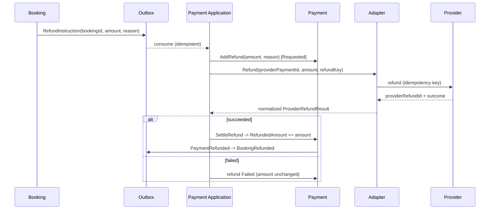

# EHUB-607 — Refund Strategy

**Status:** DRAFT — awaiting Architect review.

## Principle

> A refund is a **separate, audited operation** — never an in-place edit of the original charge (L5). The original `Succeeded` Payment stays intact; refunds are additive records that move `RefundedAmount` and derive status.

## Model

```text
Payment
  Amount             (original charge — immutable after Succeeded)
  RefundedAmount     (running total of settled refunds; 0..Amount)
  Refunds[]          (each refund = its own audited row)

Refund (child)
  RefundId
  Amount             (> 0, <= Amount - RefundedAmount)
  Reason
  Status: Requested | Succeeded | Failed
  ProviderRefundId?
  RequestedByActorId / RequestedAtUtc
  SettledAtUtc?
```

## Status derivation

| Condition after a settled refund | Payment status |
|----------------------------------|----------------|
| `RefundedAmount == 0` | unchanged (`Succeeded`) |
| `0 < RefundedAmount < Amount` | `PartiallyRefunded` |
| `RefundedAmount == Amount` | `Refunded` |

## Rules

| # | Rule |
|---|------|
| R1 | Refund allowed only from `Succeeded` or `PartiallyRefunded`. |
| R2 | `sum(settled refunds) <= Amount` — over-refund rejected (`validation_failed`). |
| R3 | Each refund is idempotent via a per-refund key (`RefundId`) at the provider (I2). |
| R4 | Refund **amount decision** belongs to Booking cancellation policy (BR-BKG-014); Payment executes the instruction. |
| R5 | A refund produces `PaymentRefunded` (Outbox) → `BookingRefunded` (L9). |
| R6 | Refund failure at provider → Refund row `Failed`, `RefundedAmount` unchanged, alert ops. Original charge unaffected. |
| R7 | Every refund writes status history + attempt audit (BR-PAY-012). |

## Who triggers a refund

| Trigger | Source | Amount |
|---------|--------|--------|
| Renter cancel ≥ 48h before start | Booking cancel (BR-BKG-014) | Full (v1 stub) |
| Renter cancel < 48h | Booking cancel | Partial / none (policy TBD) |
| Host cancel before start | Booking cancel | Full to renter |
| Late payment on Expired booking | Reconcile (L4) | **Auto-refund full** |
| Amount mismatch captured | Reconcile (BR-PAY-001) | Auto-refund captured amount |
| Admin / dispute | Admin action | Case-by-case, audited |

## Auto-refund on late callback (L4)

```text
Payment Succeeded but Booking already Expired/terminal
        ↓
Do NOT confirm booking
        ↓
System issues auto-refund (full) with reason = "late_payment_expired_booking"
        ↓
Refund Succeeded → Payment Refunded → notify customer
```

## Refund sequence



## Non-goals (v1)

- Partial-refund proration formulas (owned by Booking cancellation policy, TBD).
- Chargeback/dispute automation (manual + audited for now).
- Multi-currency refunds.

## Sign-off

- [ ] Refund-as-separate-record approved
- [ ] `RefundedAmount` derivation + over-refund guard approved
- [ ] Auto-refund on late callback approved
