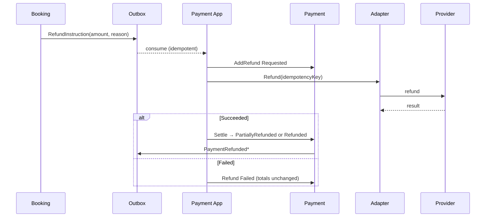

# EHUB-607 — Refund Strategy

**Status:** READY FOR ARCHITECT REVIEW

## Principle

> Refund is a **separate audited operation** (L5). Original `Amount` after success is immutable; refunds are additive rows that update `RefundedAmount` and derive status.

## Model

```text
Payment
  Amount             immutable after Succeeded
  RefundedAmount     sum of settled refunds (0..Amount)
  Refunds[]          audited children

Refund
  RefundId, Amount, Reason, Status (Requested|Succeeded|Failed)
  ProviderRefundId?, RequestedByActorId, RequestedAtUtc, SettledAtUtc?
```

## Partial vs full (explicit rules)

| Kind | Condition after settle | Payment status | Booking signal |
|------|------------------------|----------------|----------------|
| **Partial** | `0 < RefundedAmount < Amount` | `PartiallyRefunded` | Outbox: `PaymentPartiallyRefunded` (notify / policy) |
| **Full** | `RefundedAmount == Amount` | `Refunded` | Outbox: `PaymentRefunded` → `BookingRefunded` |
| Over-refund | requested `> Amount − RefundedAmount` | **Rejected** | none |

Multiple partials allowed until full. Each partial is its own `Refund` row with history.

## Rules

| # | Rule |
|---|------|
| R1 | Refund only from `Succeeded` or `PartiallyRefunded` |
| R2 | Each amount `> 0` and `≤ remaining` |
| R3 | Per-refund idempotency key (`RefundId`) at provider |
| R4 | **How much** = Booking cancellation policy; Payment **executes** |
| R5 | Provider refund fail → Refund `Failed`; `RefundedAmount` unchanged |
| R6 | Late payment on Expired Booking → **system full auto-refund** (L4) |
| R7 | Audit: status history + attempt on every refund |

## Triggers

| Trigger | Amount |
|---------|--------|
| Renter cancel ≥ 48h (BR-BKG-014) | Full (v1) |
| Renter cancel < 48h | Partial / none (policy TBD in Booking) |
| Host cancel before start | Full to renter |
| Late success / Expired Booking | **Full auto-refund** |
| Amount mismatch capture | Auto-refund captured amount |
| Admin / dispute | Case-by-case, audited |

## Sequence



## Non-goals (v1)

- Exact proration formulas (Booking policy)
- Chargeback automation
- Cross-currency refunds

## Sign-off

- [ ] Partial vs full derivation locked
- [ ] Over-refund reject locked
- [ ] Late-callback full auto-refund locked
