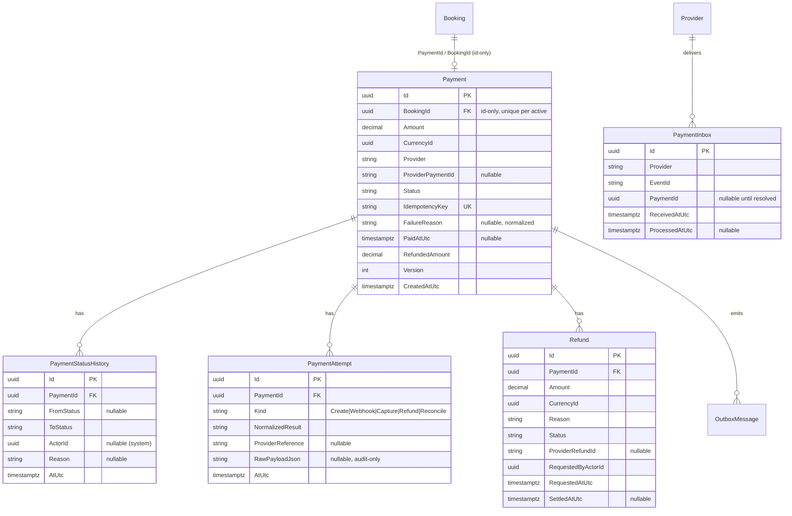

# EHUB-608 — Database Design

**Status:** DRAFT — awaiting Architect review.  
Logical model for Sprint 6.x. **No migrations this sprint.**

## ER overview

## Tables (logical)

| Table | Notes |
|-------|-------|
| `Payments` | Root: `BookingId` (id-only), money, provider, status, `IdempotencyKey`, `RefundedAmount`, `Version` |
| `Refunds` | One row per refund attempt (audited) — separate operation (L5) |
| `PaymentStatusHistory` | Append-only transition audit (BR-PAY-012) |
| `PaymentAttempts` | Provider interaction audit; `RawPayloadJson` opaque/audit-only (L8) |
| `PaymentInbox` | Processed-webhooks dedupe (L2) |
| `OutboxMessages` | Shared infra — Payment→Booking events (L9) |
| `IdempotencyKeys` | Shared infra — inbound API idempotency (I1) |

## Keys, constraints, indexes

| Object | Constraint / index |
|--------|--------------------|
| `Payments.IdempotencyKey` | **UNIQUE** |
| `Payments (BookingId)` | index; **partial unique** on non-terminal status (≤1 active payment — BR-PAY-002) |
| `Payments (ProviderPaymentId)` | index (webhook lookup); unique per provider where present |
| `Payments (Status)` | filtered index on `{Created,Pending,Authorized}` for expiry sweep |
| `PaymentInbox (Provider, EventId)` | **UNIQUE** — the dedupe mechanism (L2) |
| `Refunds (PaymentId)` | index |
| `PaymentStatusHistory (PaymentId, AtUtc)` | index |
| `Payments.RefundedAmount` | CHECK `>= 0 AND <= Amount` |
| `Payments.Amount` | CHECK `> 0` |

## Money representation

- `decimal Amount` + `uuid CurrencyId` (mirrors Booking `Money`; ADR 0006 domain primitives).
- `RefundedAmount` same currency as `Amount`; no cross-currency v1.

## Consistency notes

- **No FK enforcing Booking↔Payment** at DB level beyond id columns — they are separate aggregates (L7); referential integrity is logical, not a hard cross-aggregate FK.
- Inbox insert + status change + outbox enqueue committed in **one** transaction (I3).
- Persistence path mirrors Booking: connection string present → EF adapters; empty → InMemory (Sprint 6.1 decision).

## Sign-off

- [ ] Table set + audit tables approved
- [ ] Inbox unique `(Provider, EventId)` approved
- [ ] Partial-unique active-payment-per-booking approved
