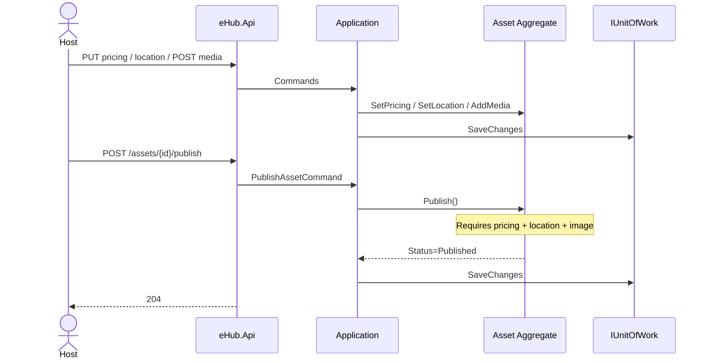
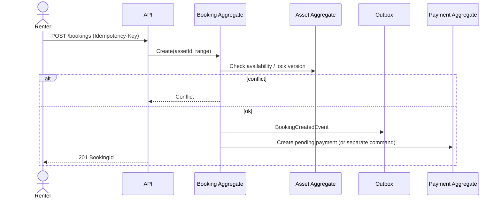
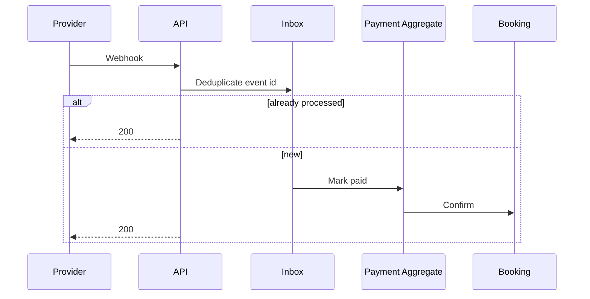

# Sequence diagrams (draft)

## Asset publish (current)

```mermaid
sequenceDiagram
  actor Host
  participant API as eHub.Api
  participant App as Application
  participant Dom as Asset Aggregate
  participant UoW as IUnitOfWork

  Host->>API: PUT pricing / location / POST media
  API->>App: Commands
  App->>Dom: SetPricing / SetLocation / AddMedia
  App->>UoW: SaveChanges
  Host->>API: POST /assets/{id}/publish
  API->>App: PublishAssetCommand
  App->>Dom: Publish()
  Note over Dom: Requires pricing + location + image
  Dom-->>App: Status=Published
  App->>UoW: SaveChanges
  API-->>Host: 204
```

## Booking create (planned)

```mermaid
sequenceDiagram
  actor Renter
  participant API
  participant Booking as Booking Aggregate
  participant Asset as Asset Aggregate
  participant Outbox
  participant Pay as Payment Aggregate

  Renter->>API: POST /bookings (Idempotency-Key)
  API->>Booking: Create(assetId, range)
  Booking->>Asset: Check availability / lock version
  alt conflict
    Booking-->>API: Conflict
  else ok
    Booking->>Outbox: BookingCreatedEvent
    Booking->>Pay: Create pending payment (or separate command)
    API-->>Renter: 201 BookingId
  end
```

## Payment webhook (planned)

```mermaid
sequenceDiagram
  participant Provider
  participant API
  participant Inbox
  participant Pay as Payment Aggregate
  participant Booking

  Provider->>API: Webhook
  API->>Inbox: Deduplicate event id
  alt already processed
    API-->>Provider: 200
  else new
    Inbox->>Pay: Mark paid
    Pay->>Booking: Confirm
    API-->>Provider: 200
  end
```
